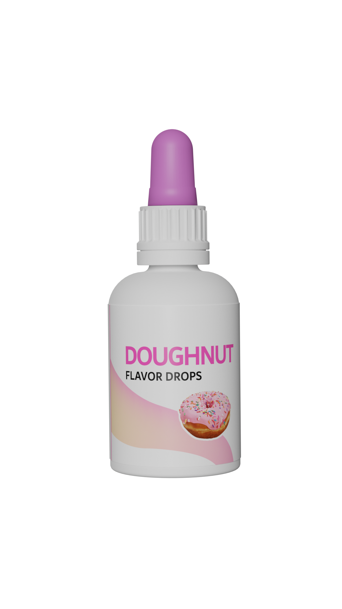
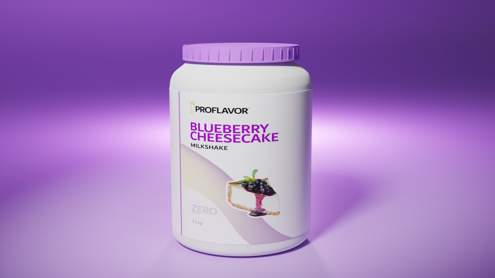
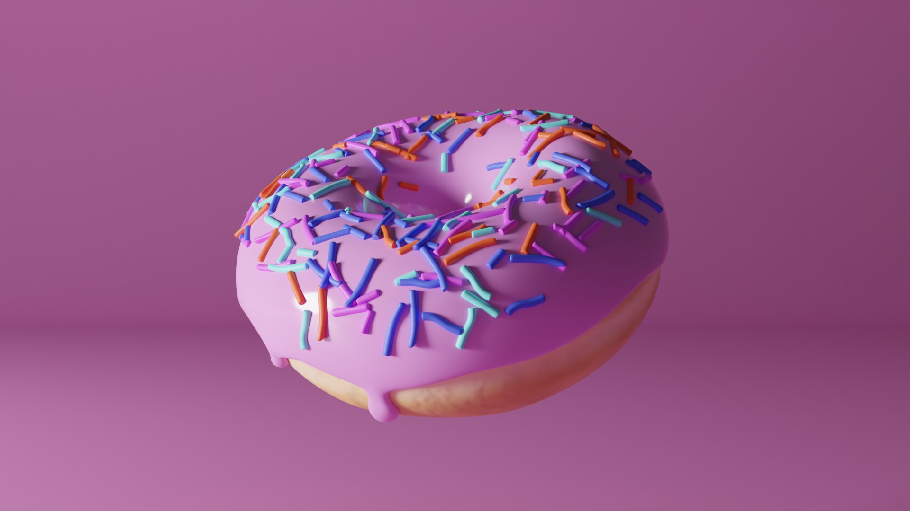

# Project Proflavor

## Assets

All visual assets were created using Adobe Photoshop, Adobe Illustrator, Blender 3.0

[Google Drive Asset File](https://drive.google.com/drive/folders/11Ujj-PuUqI6y9d43WstOKKJwoYIRMFuF?usp=sharing)

[GitHub Asset File](./assets/)

## Website

[View XD File](https://drive.google.com/file/d/1JXDyxed-xpei9ekVdmY2o38n2QrgXL7q/view?usp=sharing)

[View Website Preview](https://www.youtube.com/watch?v=dQw4w9WgXcQ)